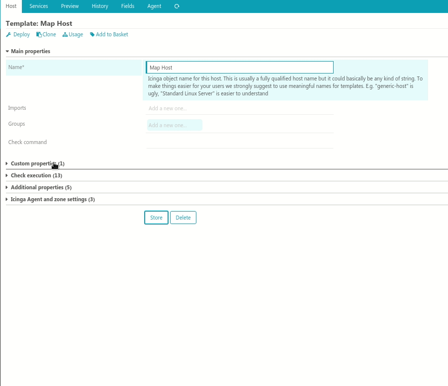
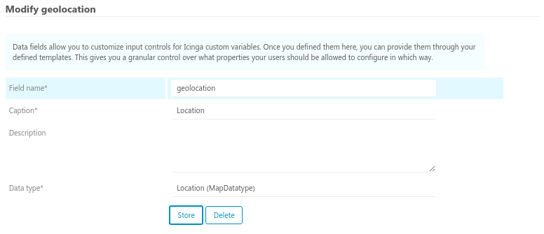

# Location datatype module for Icinga Director

#### Table of Contents

1. [About](#about)
2. [License](#license)
3. [Support](#support)
4. [Requirements](#requirements)
5. [Installation](#installation)
6. [Configuration](#configuration)
7. [FAQ](#faq)
8. [Thanks](#thanks)
9. [Contributing](#contributing)

## About

This module allows you to easily add and change coordinates with the Icinga Director on [openstreetmap](https://www.openstreetmap.org) using [leaflet.js](http://leafletjs.com/).



## License

Icinga Web 2 and this Icinga Web 2 module are licensed under the terms of the GNU General Public License Version 2, you will find a copy of this license in the LICENSE file included in the source package.

This module uses Leaflet:

* [Leaflet](https://github.com/Leaflet/Leaflet) - BSD 2-clause "Simplified" License


## Support

Join the [Icinga community channels](https://www.icinga.com/community/get-involved/) for questions.

## Requirements

* [Icinga Web 2](https://www.icinga.com/products/icinga-web-2/) (>= 2.4.1)
* [Icinga Director](https://github.com/icinga/icingaweb2-module-director)
* [Icinga Map](https://github.com/nbuchwitz/icingaweb2-module-map)


## Installation

Extract this module to your Icinga Web 2 modules directory as `mapDatatype` directory.

Git clone:

```
cd /usr/share/icingaweb2/modules
git clone https://github.com/nbuchwitz/icingaweb2-module-mapDatatype.git mapDatatype
```


Tarball download (latest [release](https://github.com/nbuchwitz/icingaweb2-module-mapDatatype/releases/latest)):

```
cd /usr/share/icingaweb2/modules
wget https://github.com/nbuchwitz/icingaweb2-module-mapDatatype/archive/v0.1.0.zip
unzip v0.1.0.zip
mv icingaweb2-module-mapDatatype-0.1.0 mapDatatype
```

### Enable Icinga Web 2 module

Enable the module in the Icinga Web 2 frontend in `Configuration -> Modules -> mapDatatype -> enable`.
You can also enable the module by using the `icingacli` command:

```
icingacli module enable mapDatatype
```

## Define Data Field

Create a new Data Field, enter a ``Field name`` and select ``Location (MapDatatype)`` in the ``Data type`` field.




## Contributing

There are many ways to contribute to the Icinga Web module for Maps --
whether it be sending patches, testing, reporting bugs, or reviewing and
updating the documentation. Every contribution is appreciated!


Please continue reading in the [contributing chapter](CONTRIBUTING.md).
